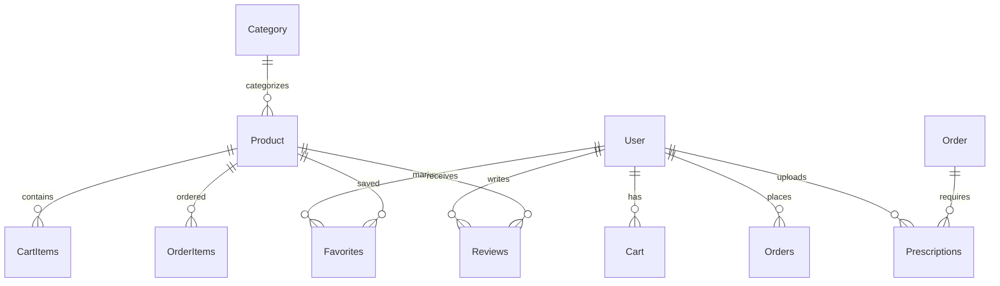

# 🎓 Pharmacy Application - Graduation Project Presentation

## Presentation Outline

### Slide 1: Title Slide
**Pharmacy Mobile Application**  
A Comprehensive Digital Pharmacy Solution  
Graduation Project Presentation  
November 2025  
Presented by: [Your Name]

---

### Slide 2: Problem Statement
## The Challenge
- **Limited Access**: Users struggle to find pharmacy products online
- **Complex Ordering**: Difficult prescription management and ordering
- **Poor User Experience**: Existing solutions lack modern UI/UX
- **Inefficient Cart Management**: No seamless shopping experience

## The Solution
A modern, user-friendly pharmacy application that combines:
- 🔐 Secure authentication
- 🛒 Intuitive shopping cart
- 💊 Prescription upload & management
- 📱 Beautiful mobile interface

---

### Slide 3: Project Goals & Objectives
## Primary Goals
✅ **User Authentication** - Secure login/registration system  
✅ **Product Browsing** - Easy search and filter capabilities  
✅ **Cart Management** - Real-time cart updates  
✅ **Prescription Upload** - Secure image handling  
✅ **Checkout Process** - Smooth order completion  

## Technical Objectives
- Modern Flutter development
- Firebase backend integration
- Scalable architecture
- Professional UI/UX design

---

### Slide 4: Technology Stack
## Frontend
- **Flutter 3.8.1+** - Cross-platform mobile framework
- **Dart** - Programming language
- **GetX** - State management & navigation
- **Glassmorphism UI** - Modern design system

## Backend
- **Firebase Authentication** - Secure user management
- **Cloud Firestore** - NoSQL database
- **Firebase Storage** - Image hosting
- **Firebase Analytics** - User behavior tracking

## Additional Technologies
- **Dio** - HTTP client
- **Cached Network Image** - Image optimization
- **Geolocator** - Location services
- **Local Notifications** - User engagement

---

### Slide 5: System Architecture
## Application Architecture
```
┌─────────────────┐    ┌─────────────────┐    ┌─────────────────┐
│   Flutter App   │◄──►│  Firebase Auth   │◄──►│   User Data     │
│                 │    │                 │    │                 │
│ - UI Components │    │ - Login/Reg     │    │ - Profiles      │
│ - State Mgmt    │    │ - Security      │    │ - Preferences   │
│ - Navigation    │    │ - Sessions      │    │ - Addresses     │
└─────────────────┘    └─────────────────┘    └─────────────────┘
         │                       │                       │
         ▼                       ▼                       ▼
┌─────────────────┐    ┌─────────────────┐    ┌─────────────────┐
│ Cloud Firestore │◄──►│ Firebase Storage│◄──►│   Analytics     │
│                 │    │                 │    │                 │
│ - Products      │    │ - Prescriptions │    │ - User Behavior │
│ - Orders        │    │ - Product Images│    │ - App Usage     │
│ - Cart Data     │    │ - Profile Pics  │    │ - Performance   │
└─────────────────┘    └─────────────────┘    └─────────────────┘
```

---

### Slide 6: Database Design
## Entity Relationship Overview


## Key Collections
- **users** - User profiles and preferences
- **products** - Pharmacy inventory
- **cart** - Shopping cart data
- **orders** - Purchase history
- **prescriptions** - Medical prescriptions
- **favourites** - Saved items

---

### Slide 7: UI/UX Design
## Design System
### Color Palette
- **Primary**: Medical Blue (#2196F3)
- **Secondary**: Health Green (#4CAF50)
- **Accent**: Alert Orange (#FF9800)
- **Background**: Clean White (#FFFFFF)

### Design Principles
- **Glassmorphism Effects** - Modern, elegant UI
- **Intuitive Navigation** - Easy-to-use interface
- **Responsive Design** - Works on all screen sizes
- **Accessibility** - Inclusive design for all users

## Key Screens
1. **Welcome & Authentication** - Clean onboarding
2. **Product Listing** - Grid layout with filters
3. **Product Details** - Comprehensive information
4. **Shopping Cart** - Real-time updates
5. **Checkout** - Streamlined process
6. **Prescription Upload** - Simple image capture

---

### Slide 8: Core Features - Authentication
## Secure User Management
### Features Implemented
- **Email/Password Login** - Traditional authentication
- **User Registration** - Simple signup process
- **Password Recovery** - Forgot password functionality
- **Session Management** - Automatic login persistence
- **Profile Management** - User data updates

### Security Measures
- Firebase Authentication security
- Input validation and sanitization
- Secure password storage
- Session timeout handling
- Data encryption in transit

---

### Slide 9: Core Features - Product Management
## Pharmacy Product System
### Product Features
- **Browse Categories** - Organized product categories
- **Search Functionality** - Real-time product search
- **Filter Options** - Price, category, availability filters
- **Product Details** - Comprehensive product information
- **Stock Availability** - Real-time inventory status
- **Product Images** - High-quality product photos

### User Experience
- **Favorites System** - Save frequently purchased items
- **Product Ratings** - User reviews and ratings
- **Related Products** - Smart recommendations
- **Recently Viewed** - Quick access to browsed items

---

### Slide 10: Core Features - Shopping Cart
## Advanced Cart Management
### Cart Features
- **Add to Cart** - One-click product addition
- **Quantity Management** - Increase/decrease quantities
- **Remove Items** - Easy item removal
- **Price Calculation** - Real-time total updates
- **Cart Persistence** - Cart saved across sessions
- **Bulk Operations** - Multiple item management

### Technical Implementation
- **Real-time Updates** - Instant cart synchronization
- **Offline Support** - Cart works without internet
- **Conflict Resolution** - Handle simultaneous updates
- **Performance Optimization** - Efficient data handling

---

### Slide 11: Core Features - Prescription Upload
## Secure Prescription Management
### Upload Features
- **Camera Integration** - Direct prescription capture
- **Gallery Selection** - Choose existing images
- **Multiple Pages** - Support for multi-page prescriptions
- **Image Compression** - Optimized file sizes
- **Upload Progress** - Visual upload feedback
- **Secure Storage** - Firebase Storage integration

### Prescription Management
- **Prescription History** - View uploaded prescriptions
- **Status Tracking** - Verification status updates
- **Link to Orders** - Connect prescriptions to purchases
- **Expiration Tracking** - Monitor prescription validity

---

### Slide 12: Core Features - Checkout Process
## Streamlined Order Completion
### Checkout Features
- **Order Summary** - Clear cart review
- **Address Selection** - Choose delivery location
- **Payment Options** - Multiple payment methods
- **Order Confirmation** - Instant order verification
- **Order Tracking** - Real-time delivery status
- **Order History** - Purchase record management

### User Experience
- **One-Page Checkout** - Minimal steps required
- **Form Validation** - Real-time input checking
- **Error Handling** - Clear error messages
- **Success Confirmation** - Order completion feedback

---

### Slide 13: Technical Implementation
## Development Approach
### Architecture Patterns
- **MVVM Pattern** - Model-View-ViewModel structure
- **Repository Pattern** - Data access abstraction
- **Dependency Injection** - Loose coupling design
- **Clean Architecture** - Separation of concerns

### Code Quality
- **Modular Design** - Reusable components
- **Error Handling** - Comprehensive error management
- **Logging System** - Debug and monitoring support
- **Unit Testing** - Code validation
- **Documentation** - Complete code documentation

---

### Slide 14: Firebase Integration
## Backend Services Implementation
### Authentication Service
```dart
class AuthService {
  Future<UserCredential> signIn(String email, String password) async {
    return await FirebaseAuth.instance.signInWithEmailAndPassword(
      email: email, 
      password: password
    );
  }
  
  Future<UserCredential> register(String email, String password) async {
    return await FirebaseAuth.instance.createUserWithEmailAndPassword(
      email: email, 
      password: password
    );
  }
}
```

### Database Service
```dart
class DatabaseService {
  Future<void> addToCart(String userId, CartItem item) async {
    await FirebaseFirestore.instance
      .collection('cart')
      .doc(userId)
      .update({
        'items': FieldValue.arrayUnion([item.toJson()])
      });
  }
}
```

---

### Slide 15: Performance Optimization
## Application Performance
### Optimization Strategies
- **Lazy Loading** - Load data on demand
- **Image Caching** - Cache product images
- **State Management** - Efficient UI updates
- **Network Optimization** - Minimize API calls
- **Memory Management** - Proper resource disposal

### Performance Metrics
- **App Launch Time** < 3 seconds
- **Screen Load Time** < 1 second
- **Image Load Time** < 2 seconds
- **API Response Time** < 500ms
- **Memory Usage** < 150MB

---

### Slide 16: Security Implementation
## Comprehensive Security Measures
### Data Protection
- **Firebase Authentication** - Secure user management
- **Firestore Security Rules** - Data access control
- **Storage Security Rules** - File access protection
- **Input Validation** - Prevent injection attacks
- **Data Encryption** - Secure data transmission

### Privacy Features
- **User Consent** - Clear permission requests
- **Data Minimization** - Collect only necessary data
- **Prescription Privacy** - Secure medical data handling
- **GDPR Compliance** - Privacy regulation adherence

---

### Slide 17: Testing & Quality Assurance
## Comprehensive Testing Strategy
### Testing Types
- **Unit Tests** - Individual component testing
- **Widget Tests** - UI component validation
- **Integration Tests** - End-to-end workflows
- **Performance Tests** - Load and stress testing
- **Security Tests** - Vulnerability assessment

### Test Coverage
- **Authentication Flow** - Login, registration, logout
- **Cart Operations** - Add, update, remove items
- **Product Browsing** - Search, filter, pagination
- **Prescription Upload** - Image handling
- **Checkout Process** - Order creation and confirmation

---

### Slide 18: Project Challenges & Solutions
## Technical Challenges
### Challenge 1: Real-time Cart Synchronization
**Problem**: Multiple devices accessing same cart  
**Solution**: Firestore real-time listeners with conflict resolution

### Challenge 2: Image Upload Optimization
**Problem**: Large prescription images  
**Solution**: Image compression and progressive upload

### Challenge 3: Offline Functionality
**Problem**: App usage without internet  
**Solution**: Local caching with sync on reconnect

### Challenge 4: Performance Optimization
**Problem**: Slow loading with large product catalogs  
**Solution**: Pagination and lazy loading implementation

---

### Slide 19: Future Enhancements
## Roadmap for Future Development
### Phase 2 Features (3-6 months)
- **Payment Gateway Integration** - Stripe/PayPal support
- **Real-time Order Tracking** - Live delivery updates
- **Push Notifications** - Order status alerts
- **Rating & Review System** - Customer feedback
- **Multi-language Support** - International expansion

### Phase 3 Features (6-12 months)
- **AI Product Recommendations** - Personalized suggestions
- **Video Consultations** - Doctor/pharmacist calls
- **Subscription Service** - Recurring deliveries
- **Pharmacy Dashboard** - Admin management panel
- **Analytics Dashboard** - Business intelligence

---

### Slide 20: Project Impact & Results
## Project Achievements
### Technical Accomplishments
✅ **Complete Flutter Application** - Fully functional mobile app  
✅ **Firebase Integration** - Scalable backend solution  
✅ **Modern UI/UX** - Professional user interface  
✅ **Real-time Features** - Live data synchronization  
✅ **Security Implementation** - Comprehensive data protection  

### Learning Outcomes
- **Mobile Development** - Flutter framework mastery
- **Cloud Services** - Firebase ecosystem proficiency
- **Database Design** - NoSQL data modeling
- **UI/UX Design** - Modern interface design
- **Project Management** - Complete development lifecycle

---

### Slide 21: Demonstration
## Live App Demonstration
### Demo Flow
1. **User Registration** - Creating new account
2. **Product Browsing** - Exploring pharmacy items
3. **Cart Management** - Adding and managing items
4. **Prescription Upload** - Capturing medical prescriptions
5. **Checkout Process** - Completing an order
6. **Order History** - Viewing past purchases

### Key Features to Highlight
- **Glassmorphism UI** - Modern design elements
- **Real-time Updates** - Live cart synchronization
- **Smooth Animations** - Professional transitions
- **Responsive Design** - Works on all devices

---

### Slide 22: Conclusion
## Project Summary
### What We Built
A comprehensive pharmacy mobile application that:
- **Solves Real Problems** - Addresses pharmacy shopping challenges
- **Uses Modern Technology** - Flutter and Firebase integration
- **Provides Excellent UX** - Intuitive and beautiful interface
- **Ensures Security** - Protects user data and privacy
- **Scales Effectively** - Architecture for future growth

### Key Takeaways
- **Technical Excellence** - Professional-grade implementation
- **User-Centered Design** - Focus on user experience
- **Future-Ready** - Scalable and maintainable codebase
- **Industry Standards** - Following best practices

---

### Slide 23: Thank You
## Questions & Discussion

### Contact Information
- **Email**: [your.email@example.com]
- **GitHub**: [github.com/yourusername]
- **LinkedIn**: [linkedin.com/in/yourprofile]

### Project Resources
- **Source Code**: Available on GitHub
- **Documentation**: Complete project docs
- **Live Demo**: App available for testing
- **Technical Blog**: Development insights

---

## Presentation Notes

### Speaker Notes
- **Duration**: 15-20 minutes presentation + 5 minutes Q&A
- **Focus**: Emphasize practical implementation and learning outcomes
- **Demo**: Have working app ready for live demonstration
- **Backup**: Screenshots and video demo as backup

### Key Points to Emphasize
1. **Problem-Solution Fit** - How the app addresses real pharmacy needs
2. **Technical Implementation** - Modern development practices
3. **User Experience** - Professional UI/UX design
4. **Future Potential** - Scalability and enhancement opportunities
5. **Personal Growth** - Skills and knowledge gained

### Preparation Checklist
- [ ] Test all app features before presentation
- [ ] Prepare demo device with stable internet
- [ ] Have screenshots ready as backup
- [ ] Practice timing for each section
- [ ] Prepare answers for common questions
- [ ] Test projector/screen sharing setup

---

**Presentation Version**: 1.0  
**Last Updated**: November 2025  
**Duration**: 20-25 minutes  
**Target Audience**: Graduation Committee, Faculty, Peers
